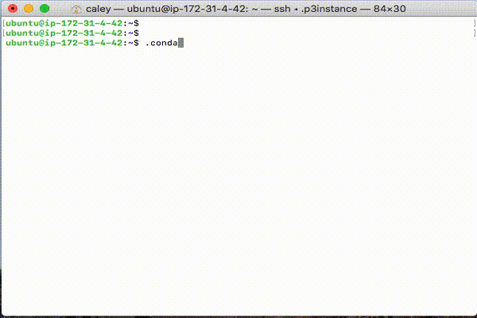

# conda connector
conda Enables you to move freely around the environment.

## Prerequisite
### Install Dependencies
Install dialog on Linux
```bash
$ sudo apt-get install dialog
```

Install dialog on Mac with brew
```bash
brew install dialog
```

## Usage
Put the `conda_connector` in a specific directory.
Then add the following command to the `.bashrc` file:

```bash
$ alias .conda='source ~/bin/conda_connector'
```

Then reconnect the terminal and run alias.
```bash
$ .conda
```

You can select a conda environment as follows:

<div style="width:50%; margin:auto; margin-bottom:10px; margin-top:20px;">

</div>
